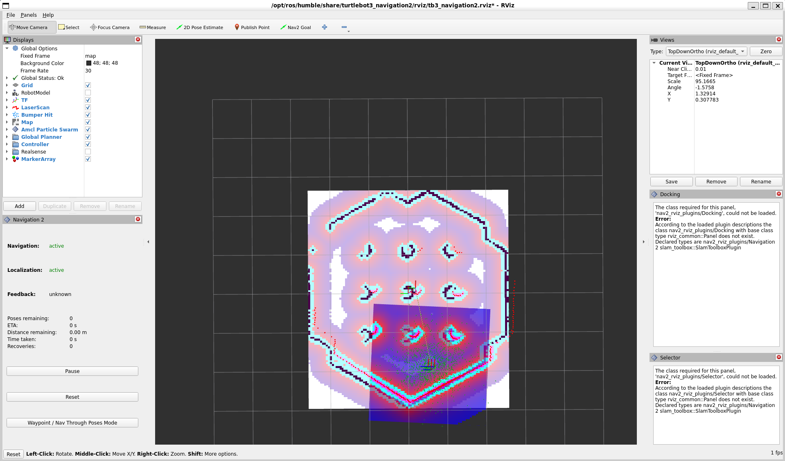
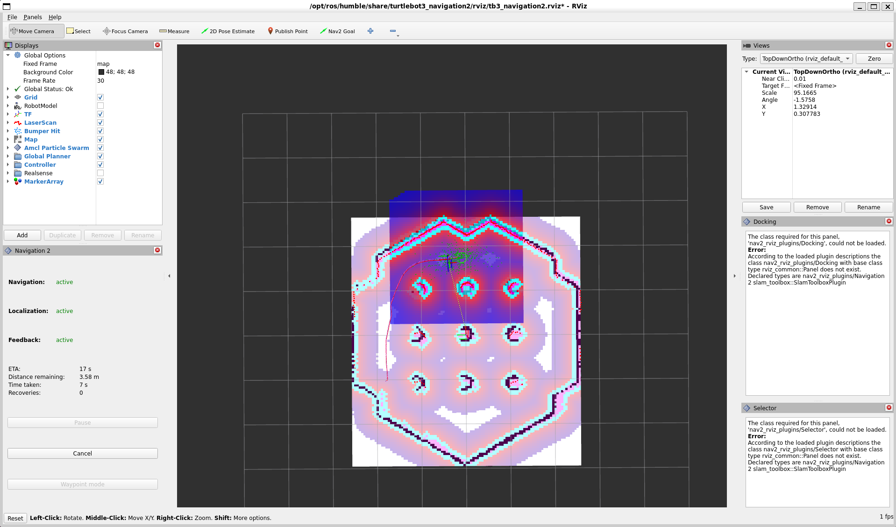
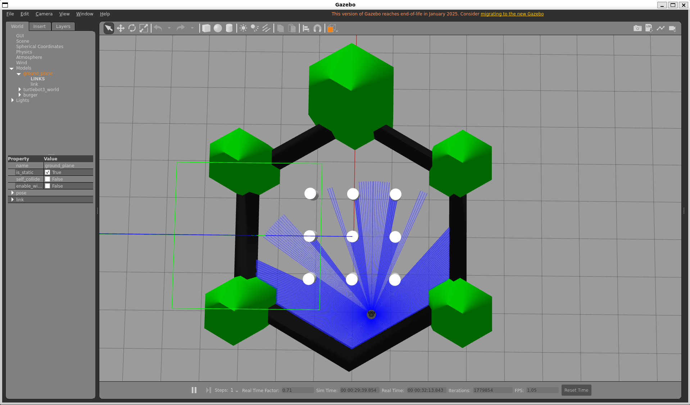
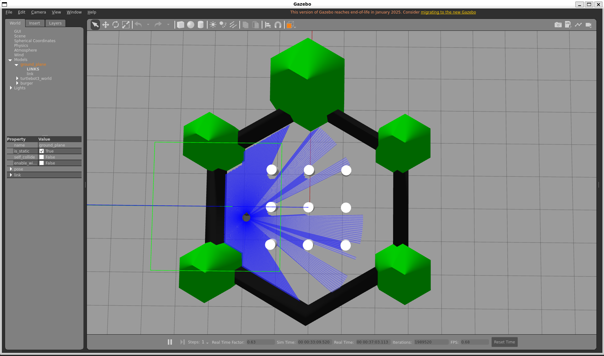

# 🚀 Intelligent Hybrid Navigation System for Autonomous Robots

## 📌 Overview
This project implements an intelligent hybrid navigation system for an autonomous mobile robot using ROS2. It combines Nav2-based global path planning with a custom LiDAR-based control layer to achieve robust and stable navigation in complex environments.

---

## 🧠 Key Features
- Hybrid navigation (Nav2 + custom control layer)
- Real-time obstacle detection using LiDAR
- State machine-based control (FORWARD, AVOID, ESCAPE)
- Intelligent escape behavior for corners and dead-ends
- Elimination of oscillatory motion
- Stable and collision-free navigation

---

## 🏗️ Architecture

Nav2 → /cmd_vel_nav  
↓  
Hybrid Node (Decision Layer)  
↓  
/cmd_vel → Robot  

---

## 🛠️ Tech Stack
- ROS2 (Humble)
- Nav2 Stack
- Python
- Gazebo
- RViz
- LiDAR (LaserScan)

---

## 📸 Screenshots

### RViz Visualization

### Gazebo Simulation

---

## 🎥 Demo

[Watch Demo](https://www.youtube.com/watch?v=KqJ4SSHZ1ac)

---

## 🚀 Results
- Successfully navigates complex environments
- Avoids obstacles dynamically
- Escapes from corners without oscillation
- Maintains stable motion

---

## 📚 Learning Outcomes
- Designed a hybrid control architecture combining planning and reactive systems
- Implemented real-time sensor-based decision-making
- Improved navigation reliability using state-machine-based logic
